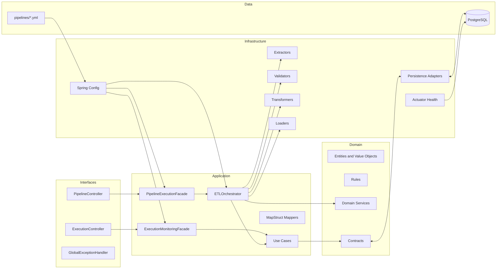
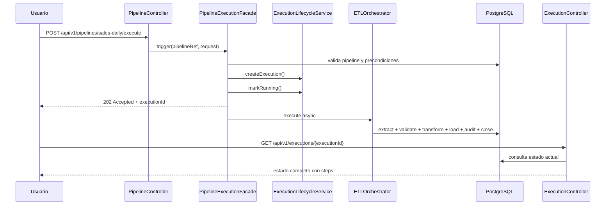
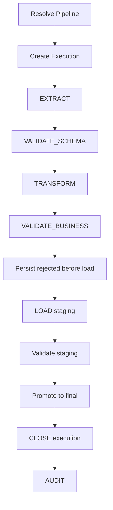

# OrionETL Current Architecture Context

Este documento esta hecho para trabajar rapido sobre el proyecto sin tener que reconstruir el contexto cada vez.

Objetivos:

- explicar la arquitectura real que existe hoy
- mostrar el flujo actual de punta a punta
- decir que recibe el sistema y que devuelve
- ubicar las clases importantes por paquete para editar sin perder tiempo

## 1. Estado actual del proyecto

Hoy OrionETL ya tiene implementado:

- Fase 2: dominio y orquestacion
- Fase 3: persistencia
- Fase 4: extractores CSV y API
- Fase 5: transformacion y validacion
- Fase 6: carga a staging y final
- Fase 7: pipeline real `sales-daily`
- Fase 8: REST API y monitoreo base
- Fase 9: pipelines `inventory-sync` y `customer-sync` + `ExcelExtractor`

Lo que ya puedes hacer:

- ejecutar `sales-daily` end-to-end
- ejecutar `inventory-sync` end-to-end
- ejecutar `customer-sync` end-to-end
- dispararlo por REST
- hacer polling por `executionId`
- consultar rechazados y metricas
- revisar estado general con `/actuator/health`
- revisar reintentos automáticos en `ExecutePipelineUseCase` / `PipelineExecutionRunner`
- revisar hooks operativos de cierre en `infrastructure/notification/`

Lo que aun falta:

- UI/dashboard de monitoreo

## 2. Vista rapida de arquitectura



## 3. Flujo operativo real

### 3.1 Si disparas un pipeline por REST



### 3.2 Flujo ETL interno



## 4. Que entra y que sale

### 4.1 Entrada al sistema por REST

#### Ejecutar pipeline

`POST /api/v1/pipelines/{pipelineRef}/execute`

Body:

```json
{
  "triggeredBy": "api:elya",
  "parameters": {
    "batch_date": "2026-03-23"
  }
}
```

Que recibe:

- `pipelineRef`: UUID o nombre como `sales-daily`
- `triggeredBy`: quien lo dispara
- `parameters`: parametros opcionales del pipeline

Que devuelve:

```json
{
  "success": true,
  "data": {
    "executionId": "01234567-89ab-cdef-0123-456789abcdef",
    "pipelineId": "9b4d1aa8-e5f2-4e38-b3cc-aeb89d3ab001",
    "pipelineName": "sales-daily",
    "status": "RUNNING",
    "startedAt": "2026-03-23T10:00:00Z",
    "triggeredBy": "api:elya"
  }
}
```

#### Polling de ejecucion

`GET /api/v1/executions/{executionId}`

Que devuelve:

- estado global
- conteos acumulados
- pasos (`INIT`, `EXTRACT`, `VALIDATE_SCHEMA`, `TRANSFORM`, `VALIDATE_BUSINESS`, `LOAD`, `CLOSE`, `AUDIT`)

#### Metricas

`GET /api/v1/executions/{executionId}/metrics`

Que devuelve hoy:

- `records.read`
- `records.transformed`
- `records.rejected`
- `records.loaded`
- `error.rate.percent`
- `duration.ms`
- `extract.duration.ms`
- `transform.duration.ms`
- `load.duration.ms`

#### Rechazados

`GET /api/v1/executions/{executionId}/rejected?page=0&size=50`

Que devuelve:

- pagina de `RejectedRecordDto`
- `rowNumber`
- `rawData`
- `rejectionReason`
- `rejectedAt`

## 5. Como pensar la arquitectura

Regla simple:

- `interfaces` recibe peticiones
- `application` coordina
- `domain` decide reglas
- `infrastructure` hace el trabajo tecnico
- `shared` contiene piezas transversales

Otra forma de verlo:

- si cambias HTTP: toca `interfaces`
- si cambias el flujo ETL: toca `application/orchestrator` o `application/usecase`
- si cambias reglas de negocio: toca `domain` o `infrastructure/validator`
- si cambias conectores/DB/CSV/API: toca `infrastructure`

## 6. Donde editar segun lo que quieras cambiar

| Quieres cambiar | Punto principal |
|---|---|
| endpoint REST | `interfaces/rest/controller/` |
| formato de errores HTTP | `interfaces/rest/handler/GlobalExceptionHandler.java` |
| request de ejecucion | `interfaces/rest/request/ExecutePipelineRequest.java` |
| disparo async por REST | `application/facade/PipelineExecutionFacade.java` |
| polling, metricas o rechazados | `application/facade/ExecutionMonitoringFacade.java` |
| flujo ETL completo | `application/orchestrator/ETLOrchestrator.java` |
| caso de uso puntual | `application/usecase/...` |
| reglas de ejecucion | `domain/service/PipelineOrchestrationService.java` y `domain/rules/...` |
| modelo de pipeline | `domain/model/pipeline/Pipeline.java` |
| extractor CSV/API/Excel | `infrastructure/extractor/...` |
| transformacion comun | `infrastructure/transformer/CommonTransformer.java` |
| transformacion de sales | `infrastructure/transformer/sales/SalesTransformer.java` |
| transformacion de inventory | `infrastructure/transformer/inventory/InventoryTransformer.java` |
| transformacion de customer | `infrastructure/transformer/customer/CustomerTransformer.java` |
| validacion schema | `infrastructure/validator/SchemaValidator.java` |
| validacion negocio | `infrastructure/validator/BusinessValidator.java` |
| carga a DB | `infrastructure/loader/database/...` |
| persistencia JPA | `infrastructure/persistence/adapter/...` |
| schema SQL | `src/main/resources/db/migration/` |
| health de actuator | `infrastructure/monitoring/ETLEngineHealthIndicator.java` |
| pipeline sales declarativo | `src/main/resources/pipelines/sales.yml` |
| pipeline inventory declarativo | `src/main/resources/pipelines/inventory.yml` |
| pipeline customer declarativo | `src/main/resources/pipelines/customer.yml` |

## 7. Atlas de clases

Esta seccion agrupa las clases principales del proyecto y te dice para que sirven.

### 7.1 Bootstrap

| Clase | Rol |
|---|---|
| `com/elyares/etl/EtlApplication.java` | entrada principal de Spring Boot |

### 7.2 Interfaces REST

| Clase | Rol |
|---|---|
| `interfaces/rest/controller/PipelineController.java` | lista pipelines, consulta detalle, historial y dispara ejecuciones |
| `interfaces/rest/controller/ExecutionController.java` | polling, metricas y rechazados |
| `interfaces/rest/request/ExecutePipelineRequest.java` | body HTTP para `POST /execute` |
| `interfaces/rest/handler/GlobalExceptionHandler.java` | traduce excepciones a respuestas HTTP |

### 7.3 Application DTOs

| Clase | Rol |
|---|---|
| `application/dto/PipelineDto.java` | vista externa segura de un pipeline |
| `application/dto/PipelineExecutionDto.java` | estado completo de una ejecucion |
| `application/dto/ExecutionStatusDto.java` | resumen corto para polling ligero |
| `application/dto/ExecutionAcceptedDto.java` | respuesta de `202 Accepted` |
| `application/dto/ExecutionRequestDto.java` | request interno para ejecutar un pipeline |
| `application/dto/ExecutionStepDto.java` | estado de un paso |
| `application/dto/ExecutionMetricDto.java` | metrica numerica expuesta por REST |
| `application/dto/RejectedRecordDto.java` | rechazo expuesto por REST |
| `application/dto/AuditRecordDto.java` | registro de auditoria expuesto hacia afuera |

### 7.4 Application Facades

| Clase | Rol |
|---|---|
| `application/facade/PipelineExecutionFacade.java` | dispara ejecuciones async para REST |
| `application/facade/ExecutionMonitoringFacade.java` | arma vistas de monitoreo, metricas y rechazados |

### 7.5 Application Mappers

| Clase | Rol |
|---|---|
| `application/mapper/PipelineMapper.java` | `Pipeline` -> `PipelineDto` |
| `application/mapper/ExecutionMapper.java` | `PipelineExecution` -> DTOs de ejecucion, auditoria y metricas |

### 7.6 Application Orchestration

| Clase | Rol |
|---|---|
| `application/orchestrator/ETLOrchestrator.java` | flujo ETL de 8 pasos |
| `application/orchestrator/OrchestrationContext.java` | estado en memoria entre pasos |

### 7.7 Use Cases

| Clase | Rol |
|---|---|
| `application/usecase/pipeline/GetPipelineUseCase.java` | resuelve pipeline por UUID o nombre |
| `application/usecase/pipeline/ListPipelinesUseCase.java` | lista pipelines |
| `application/usecase/pipeline/ResolvePipelineConfigUseCase.java` | resuelve config declarativa del pipeline |
| `application/usecase/execution/ExecutePipelineUseCase.java` | ejecucion sincronica del pipeline |
| `application/usecase/execution/GetExecutionStatusUseCase.java` | estado resumido por `executionId` |
| `application/usecase/execution/ListExecutionsUseCase.java` | historial de ejecuciones por pipeline |
| `application/usecase/execution/RetryExecutionUseCase.java` | genera reintentos cuando aplica |
| `application/usecase/extraction/ExtractDataUseCase.java` | selecciona extractor y ejecuta extract |
| `application/usecase/transformation/TransformDataUseCase.java` | selecciona transformer y transforma |
| `application/usecase/validation/ValidateInputDataUseCase.java` | validacion estructural |
| `application/usecase/validation/ValidateBusinessDataUseCase.java` | validacion de negocio |
| `application/usecase/validation/ValidationChainExecutor.java` | ejecuta validadores en cadena |
| `application/usecase/loading/LoadProcessedDataUseCase.java` | carga datos procesados |
| `application/usecase/loading/PersistRejectedRecordsUseCase.java` | persiste rechazados |
| `application/usecase/loading/RegisterAuditUseCase.java` | persiste auditoria |

### 7.8 Domain Contracts

| Clase | Rol |
|---|---|
| `domain/contract/PipelineRepository.java` | puerto para pipelines |
| `domain/contract/ExecutionRepository.java` | puerto para ejecuciones |
| `domain/contract/RejectedRecordRepository.java` | puerto para rechazados |
| `domain/contract/AuditRepository.java` | puerto para auditoria |
| `domain/contract/DataExtractor.java` | contrato de extractores |
| `domain/contract/DataTransformer.java` | contrato de transformadores |
| `domain/contract/DataValidator.java` | contrato de validadores |
| `domain/contract/DataLoader.java` | contrato de loaders |

### 7.9 Domain Services y Rules

| Clase | Rol |
|---|---|
| `domain/service/PipelineOrchestrationService.java` | precondiciones y estado final de ejecucion |
| `domain/service/ExecutionLifecycleService.java` | crea, inicia y cierra ejecuciones |
| `domain/service/DataQualityService.java` | calcula calidad y threshold |
| `domain/rules/NoDuplicateExecutionRule.java` | evita ejecuciones activas duplicadas |
| `domain/rules/AllowedExecutionWindowRule.java` | valida ventana horaria |
| `domain/rules/CriticalErrorBlocksSuccessRule.java` | evita `SUCCESS` con errores criticos |
| `domain/rules/RetryEligibilityRule.java` | decide si se puede reintentar |
| `domain/rules/ErrorThresholdRule.java` | aplica threshold de calidad |

### 7.10 Domain Models

| Clase | Rol |
|---|---|
| `domain/model/pipeline/Pipeline.java` | agregado principal de configuracion ETL |
| `domain/model/pipeline/PipelineVersion.java` | version de pipeline |
| `domain/model/pipeline/ScheduleConfig.java` | cron, timezone y ventanas |
| `domain/model/pipeline/RetryPolicy.java` | politica de reintentos |
| `domain/model/source/SourceConfig.java` | configuracion de origen |
| `domain/model/source/RawRecord.java` | registro crudo |
| `domain/model/source/ExtractionResult.java` | resultado de extract |
| `domain/model/transformation/TransformationConfig.java` | reglas configurables de transformacion |
| `domain/model/transformation/TransformationResult.java` | procesados + rechazados de transform |
| `domain/model/validation/ValidationConfig.java` | reglas de schema y negocio |
| `domain/model/validation/ValidationError.java` | error puntual de validacion |
| `domain/model/validation/ValidationResult.java` | validos, rechazados y calidad |
| `domain/model/validation/RejectedRecord.java` | registro rechazado con contexto |
| `domain/model/validation/DataQualityReport.java` | resumen de calidad del lote |
| `domain/model/target/TargetConfig.java` | configuracion de destino |
| `domain/model/target/ProcessedRecord.java` | registro transformado |
| `domain/model/target/LoadResult.java` | resultado de la carga |
| `domain/model/target/StagingValidationResult.java` | resultado de validar staging |
| `domain/model/execution/PipelineExecution.java` | agregado de ejecucion ETL |
| `domain/model/execution/PipelineExecutionStep.java` | paso individual |
| `domain/model/execution/ExecutionError.java` | error clasificado |
| `domain/model/execution/ExecutionMetric.java` | metrica numerica |
| `domain/model/audit/AuditRecord.java` | evidencia de auditoria |

### 7.11 Domain Value Objects y Enums

| Clase | Rol |
|---|---|
| `domain/valueobject/PipelineId.java` | UUID de pipeline |
| `domain/valueobject/ExecutionId.java` | UUID publico de ejecucion |
| `domain/valueobject/RecordCount.java` | contador validado |
| `domain/valueobject/ErrorThreshold.java` | threshold de error |
| `domain/valueobject/BusinessKey.java` | clave de negocio compuesta |
| `domain/enums/ExecutionStatus.java` | estado de ejecucion |
| `domain/enums/StepStatus.java` | estado de paso |
| `domain/enums/TriggerType.java` | origen del disparo |
| `domain/enums/SourceType.java` | tipo de fuente |
| `domain/enums/TargetType.java` | tipo de destino |
| `domain/enums/LoadStrategy.java` | estrategia de promotion/load |
| `domain/enums/RollbackStrategy.java` | estrategia de rollback |
| `domain/enums/PipelineStatus.java` | estado del pipeline |
| `domain/enums/ErrorType.java` | clasificacion del error |
| `domain/enums/ErrorSeverity.java` | severidad del error |

### 7.12 Infrastructure Config

| Clase | Rol |
|---|---|
| `infrastructure/config/CoreUseCaseConfig.java` | wiring principal de beans |
| `infrastructure/config/Phase5UseCaseConfig.java` | wiring de transformacion/validacion |
| `infrastructure/config/AsyncExecutionConfig.java` | `TaskExecutor` para REST async |

### 7.13 Infrastructure Extractors

| Clase | Rol |
|---|---|
| `infrastructure/extractor/ExtractorRegistry.java` | resuelve extractor por `SourceType` |
| `infrastructure/extractor/csv/CsvExtractor.java` | lee CSV |
| `infrastructure/extractor/csv/CsvPreviewRunner.java` | preview de CSV por consola |
| `infrastructure/extractor/api/ApiExtractor.java` | consume APIs HTTP |

### 7.14 Infrastructure Transformers

| Clase | Rol |
|---|---|
| `infrastructure/transformer/CommonTransformer.java` | reglas genericas comunes |
| `infrastructure/transformer/TransformerChain.java` | chain/default transformer |
| `infrastructure/transformer/sales/SalesTransformer.java` | logica especifica del pipeline sales |

### 7.15 Infrastructure Validators

| Clase | Rol |
|---|---|
| `infrastructure/validator/SchemaValidator.java` | mandatory columns, tipos, patrones |
| `infrastructure/validator/BusinessValidator.java` | catalogos, ranges, fechas, unicidad |
| `infrastructure/validator/QualityValidator.java` | resumen de calidad del lote |

### 7.16 Infrastructure Loaders

| Clase | Rol |
|---|---|
| `infrastructure/loader/database/DatabaseDataLoader.java` | loader principal JDBC |
| `infrastructure/loader/database/StagingLoader.java` | inserta a staging |
| `infrastructure/loader/database/StagingValidator.java` | valida staging antes de promover |
| `infrastructure/loader/database/FinalLoader.java` | promotion a tabla final |
| `infrastructure/loader/database/DatabaseLoadSupport.java` | SQL y conversion JDBC |
| `infrastructure/loader/database/StagingLoadResult.java` | resultado tecnico de carga a staging |

### 7.17 Infrastructure Persistence

| Clase | Rol |
|---|---|
| `infrastructure/persistence/adapter/PipelineRepositoryAdapter.java` | implementa `PipelineRepository` |
| `infrastructure/persistence/adapter/ExecutionRepositoryAdapter.java` | implementa `ExecutionRepository` |
| `infrastructure/persistence/adapter/RejectedRecordRepositoryAdapter.java` | implementa `RejectedRecordRepository` |
| `infrastructure/persistence/adapter/AuditRepositoryAdapter.java` | implementa `AuditRepository` |
| `infrastructure/persistence/mapper/PersistenceJsonMapper.java` | serializa/deserializa JSONB |
| `infrastructure/persistence/entity/EtlPipelineEntity.java` | tabla `etl_pipelines` |
| `infrastructure/persistence/entity/EtlPipelineExecutionEntity.java` | tabla `etl_pipeline_executions` |
| `infrastructure/persistence/entity/EtlExecutionStepEntity.java` | tabla `etl_execution_steps` |
| `infrastructure/persistence/entity/EtlExecutionErrorEntity.java` | tabla `etl_execution_errors` |
| `infrastructure/persistence/entity/EtlExecutionMetricEntity.java` | tabla `etl_execution_metrics` |
| `infrastructure/persistence/entity/EtlRejectedRecordEntity.java` | tabla `etl_rejected_records` |
| `infrastructure/persistence/entity/EtlAuditRecordEntity.java` | tabla `etl_audit_records` |
| `infrastructure/persistence/repository/JpaEtlPipelineRepository.java` | Spring Data de pipelines |
| `infrastructure/persistence/repository/JpaEtlPipelineExecutionRepository.java` | Spring Data de ejecuciones |
| `infrastructure/persistence/repository/JpaEtlExecutionStepRepository.java` | Spring Data de pasos |
| `infrastructure/persistence/repository/JpaEtlExecutionErrorRepository.java` | Spring Data de errores |
| `infrastructure/persistence/repository/JpaEtlExecutionMetricRepository.java` | Spring Data de metricas |
| `infrastructure/persistence/repository/JpaEtlRejectedRecordRepository.java` | Spring Data de rechazados |
| `infrastructure/persistence/repository/JpaEtlAuditRecordRepository.java` | Spring Data de auditoria |

### 7.18 Monitoring y Pipelines

| Clase | Rol |
|---|---|
| `infrastructure/monitoring/ETLEngineHealthIndicator.java` | estado operacional del motor para Actuator |
| `pipelines/sales/SalesPipelineConfig.java` | registra el pipeline `sales-daily` desde YAML |

### 7.19 Shared

| Clase | Rol |
|---|---|
| `shared/constants/StepNames.java` | nombres canonicos de pasos |
| `shared/constants/MetricKeys.java` | nombres canonicos de metricas |
| `shared/constants/ErrorCodes.java` | catalogo de codigos de error |
| `shared/exception/EtlException.java` | base de errores ETL |
| `shared/exception/PipelineNotFoundException.java` | pipeline no encontrado |
| `shared/exception/ExecutionNotFoundException.java` | ejecucion no encontrada |
| `shared/exception/ExecutionConflictException.java` | ejecucion activa duplicada |
| `shared/exception/ExtractionException.java` | fallo en extract |
| `shared/exception/TransformationException.java` | fallo en transform |
| `shared/exception/ValidationException.java` | fallo de validacion |
| `shared/exception/LoadingException.java` | fallo de load |
| `shared/exception/RetryExhaustedException.java` | reintentos agotados |
| `shared/logging/ExecutionMdcContext.java` | MDC por ejecucion |
| `shared/logging/MdcCleaner.java` | limpia MDC |
| `shared/response/ApiResponse.java` | wrapper exitoso REST |
| `shared/response/ErrorResponse.java` | wrapper de error REST |
| `shared/response/PagedResponse.java` | wrapper paginado REST |
| `shared/util/DateUtils.java` | parsing y normalizacion de fechas |
| `shared/util/StringUtils.java` | utilidades de string |
| `shared/util/JsonUtils.java` | utilidades JSON |

## 8. Archivos de configuracion y datos clave

| Archivo | Para que sirve |
|---|---|
| `src/main/resources/application.yml` | config base Spring Boot y Actuator |
| `src/main/resources/application-docker.yml` | overrides para contenedores |
| `src/main/resources/pipelines/sales.yml` | declaracion del pipeline sales |
| `src/main/resources/db/migration/V1__create_etl_schema.sql` | metadata base ETL |
| `src/main/resources/db/migration/V3__create_sales_load_tables.sql` | tablas sales staging/final |
| `src/main/resources/db/migration/V4__expand_sales_tables_for_phase7.sql` | columnas adicionales de sales |
| `src/main/resources/db/migration/V5__add_source_row_number_to_rejected_records.sql` | numero de fila en rechazados |

## 9. Flujo minimo para usar el sistema hoy

1. Levanta `db` y `app`.
2. Verifica `GET /actuator/health`.
3. Consulta `GET /api/v1/pipelines`.
4. Dispara `POST /api/v1/pipelines/sales-daily/execute`.
5. Guarda `executionId`.
6. Haz polling con `GET /api/v1/executions/{executionId}`.
7. Si hubo errores, revisa:
   - `GET /api/v1/executions/{executionId}/metrics`
   - `GET /api/v1/executions/{executionId}/rejected`

## 10. Si vas a editar algo rapido

Checklist mental:

1. Ubica la capa correcta.
2. Revisa si existe DTO o facade antes de tocar controller.
3. Revisa si la regla vive en `domain` antes de meterla en `infrastructure`.
4. Si cambias un modelo persistido, revisa:
   - entidad JPA
   - adapter
   - migration SQL
   - DTO de salida si aplica
5. Si cambias el flujo ETL, valida:
   - unit tests
   - pipeline `sales-daily`
   - endpoints REST si exponen ese estado
