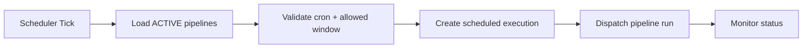
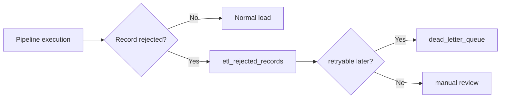

# V2 Roadmap

## Objetivo

Definir la siguiente iteración del motor después del cierre de V1. La prioridad es pasar de un motor manual-orquestado a una plataforma operable de forma continua, con mejor restartability, scheduler y observabilidad.

## 1. Migración a Spring Batch

Referencia base:

- [ADR-002: Spring Batch](../decisions/ADR-002-spring-batch.md)

Plan:

1. Reemplazar el `ETLOrchestrator` manual por `Job`, `Step` y `Chunk` de Spring Batch.
2. Modelar cada etapa actual como step explícito:
   - `extract`
   - `validateSchema`
   - `transform`
   - `validateBusiness`
   - `loadStaging`
   - `validateStaging`
   - `promoteFinal`
   - `audit`
3. Persistir metadata de job/step en tablas Batch para permitir restart desde checkpoint.
4. Mantener compatibilidad con `etl_pipeline_executions` como capa de auditoría de negocio.

Resultado esperado:

- restart desde el último chunk confirmado
- mejor control transaccional por step
- scheduler y operaciones estándar sobre jobs

## 2. Scheduler

### Diseño propuesto

Entrada:

- leer `schedule-config` desde los YAML ya existentes

Componente:

- `interfaces/scheduler/`
- trigger por `@Scheduled` o Quartz si se requiere calendario más complejo

Flujo:

Reglas:

- no disparar si ya existe ejecución `RUNNING` o `RETRYING`
- respetar `allowed-windows`
- registrar `triggerType=SCHEDULED`

## 3. Dashboard Operativo

### Wireframe textual

Vista 1: Pipeline Overview

- lista de pipelines
- último estado
- última ejecución
- siguiente ejecución programada
- conteos de éxito/fallo/partial últimos 7 días

Vista 2: Execution Detail

- estado actual
- steps y duración
- métricas de lectura/transformación/carga
- errores clasificados
- chain de retries

Vista 3: Rejected Records

- tabla paginada
- filtro por pipeline, ejecución, step, regla
- preview del payload rechazado

Vista 4: Health & Capacity

- salud de app y db
- ejecuciones activas
- throughput
- error rate

## 4. Extractores pendientes

### DatabaseExtractor

Estado:

- completado en V1 como bonus de cierre

Entregado en V1:

- conexión JDBC configurable desde `SourceConfig`
- `JdbcTemplate` con soporte de named parameters
- `fetchSize`
- query parametrizable
- binding seguro de parámetros

Alcance V2:

- optimización por driver/vendor
- lectura cursor más fina para datasets muy grandes
- presets por engine (`postgres`, `mysql`, `sqlserver`)
- soporte extendido de tipos y estrategias incrementales

### ExcelExtractor

Estado:

- completado en V1

Pendiente V2:

- streaming optimizado para archivos grandes
- soporte avanzado de fórmulas y celdas mixtas

## 5. Webhook Notifications

Estado:

- stub creado en V1

Alcance V2:

- configuración por pipeline o global
- webhook para `SUCCESS`, `FAILED`, `PARTIAL`
- firma HMAC opcional
- retries independientes del pipeline principal
- circuit breaker para evitar cascadas de fallo

## 6. Dead-letter Queue

Objetivo:

- sacar del flujo principal los registros persistentemente fallidos para revisión posterior

Diseño:

Campos mínimos:

- `pipeline_id`
- `execution_id`
- `source_reference`
- `source_row_number`
- `payload`
- `validation_errors`
- `retryable`
- `first_seen_at`
- `last_attempt_at`

## 7. Resultado esperado de V2

Al cerrar V2, OrionETL debería tener:

- scheduler nativo
- restart desde checkpoint
- dashboard operativo
- webhook notifications reales
- optimización avanzada de `DatabaseExtractor`
- manejo explícito de dead-letter queue
