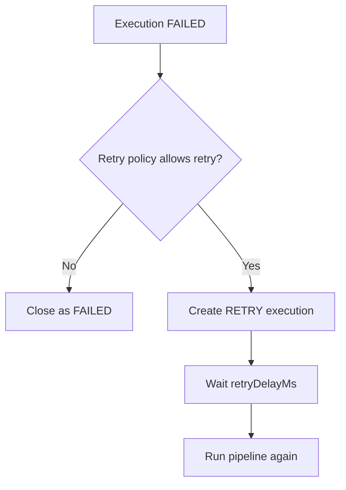

# Agent Handoff Context

## Objetivo

Este documento le da a otro agente el contexto mínimo pero suficiente para entrar a OrionETL y trabajar sin perder tiempo reconstruyendo el proyecto desde cero.

Sirve para entender:

- qué hace el sistema
- qué partes ya están terminadas en V1
- cómo correrlo y probarlo
- cómo está organizada la arquitectura
- dónde tocar si se necesita una nueva integración
- qué convenciones seguir para no romper el flujo actual

---

## 1. Qué es OrionETL

OrionETL es un motor ETL construido con:

- Java 21
- Spring Boot 3
- PostgreSQL
- Flyway
- Docker / Docker Compose

El sistema ejecuta pipelines configurados por YAML. Cada pipeline:

1. extrae datos desde una fuente
2. valida estructura
3. transforma
4. valida reglas de negocio y calidad
5. carga a `staging`
6. valida staging
7. promueve a tabla final
8. registra auditoría, métricas y rechazados

---

## 2. Estado real del proyecto

V1 está funcional y cerrado.

Capacidades activas:

- extractores: `CSV`, `API`, `EXCEL`, `DATABASE`
- transformadores base y específicos por pipeline
- validadores estructurales, de negocio y calidad
- loaders a base de datos con `staging` y promoción final
- REST API para disparar y consultar ejecuciones
- health endpoint por Actuator
- retries automáticos para fallos reintentables
- notificaciones por log
- auditoría y rechazados persistidos

Pipelines reales implementados:

- `sales-daily`
- `inventory-sync`
- `customer-sync`

---

## 3. Flujo completo del sistema


Flujo de fallo:



---

## 4. Arquitectura real

El proyecto sigue una estructura tipo hexagonal.

### `domain/`

Contiene el modelo puro y contratos:

- `model/`
- `enum/`
- `valueobject/`
- `contract/`
- `service/`
- `rules/`

Regla importante:

- `domain/` no debe depender de Spring

### `application/`

Orquesta casos de uso:

- `usecase/`
- `orchestrator/`
- `dto/`
- `mapper/`
- `facade/`

Aquí vive el flujo ETL completo y la coordinación entre piezas.

### `infrastructure/`

Contiene adaptadores concretos:

- `extractor/`
- `transformer/`
- `validator/`
- `loader/`
- `persistence/`
- `notification/`
- `monitoring/`
- `config/`

### `interfaces/`

Entrada HTTP:

- controllers REST
- handlers HTTP

### `pipelines/` y `resources/pipelines/`

Configuración concreta de pipelines:

- clases Java que resuelven config
- YAML por pipeline

---

## 5. Clases clave que otro agente debe conocer

### Orquestación principal

- [ETLOrchestrator.java](/home/elyarestark/develop/OrionETL/src/main/java/com/elyares/etl/application/orchestrator/ETLOrchestrator.java)
  Ejecuta el flujo ETL completo.

- [PipelineExecutionRunner.java](/home/elyarestark/develop/OrionETL/src/main/java/com/elyares/etl/application/usecase/execution/PipelineExecutionRunner.java)
  Encadena reintentos automáticos.

- [ExecutePipelineUseCase.java](/home/elyarestark/develop/OrionETL/src/main/java/com/elyares/etl/application/usecase/execution/ExecutePipelineUseCase.java)
  Punto de entrada para correr un pipeline.

### Resolución de pipeline

- [GetPipelineUseCase.java](/home/elyarestark/develop/OrionETL/src/main/java/com/elyares/etl/application/usecase/pipeline/GetPipelineUseCase.java)
- [PipelineRepositoryAdapter.java](/home/elyarestark/develop/OrionETL/src/main/java/com/elyares/etl/infrastructure/persistence/adapter/PipelineRepositoryAdapter.java)

### Extracción

- [ExtractorRegistry.java](/home/elyarestark/develop/OrionETL/src/main/java/com/elyares/etl/infrastructure/extractor/ExtractorRegistry.java)
- [CsvExtractor.java](/home/elyarestark/develop/OrionETL/src/main/java/com/elyares/etl/infrastructure/extractor/csv/CsvExtractor.java)
- [ApiExtractor.java](/home/elyarestark/develop/OrionETL/src/main/java/com/elyares/etl/infrastructure/extractor/api/ApiExtractor.java)
- [ExcelExtractor.java](/home/elyarestark/develop/OrionETL/src/main/java/com/elyares/etl/infrastructure/extractor/excel/ExcelExtractor.java)
- [DatabaseExtractor.java](/home/elyarestark/develop/OrionETL/src/main/java/com/elyares/etl/infrastructure/extractor/database/DatabaseExtractor.java)

### Transformación y validación

- [TransformDataUseCase.java](/home/elyarestark/develop/OrionETL/src/main/java/com/elyares/etl/application/usecase/transformation/TransformDataUseCase.java)
- [CommonTransformer.java](/home/elyarestark/develop/OrionETL/src/main/java/com/elyares/etl/infrastructure/transformer/CommonTransformer.java)
- [TransformerChain.java](/home/elyarestark/develop/OrionETL/src/main/java/com/elyares/etl/infrastructure/transformer/TransformerChain.java)
- [SchemaValidator.java](/home/elyarestark/develop/OrionETL/src/main/java/com/elyares/etl/infrastructure/validator/SchemaValidator.java)
- [BusinessValidator.java](/home/elyarestark/develop/OrionETL/src/main/java/com/elyares/etl/infrastructure/validator/BusinessValidator.java)
- [QualityValidator.java](/home/elyarestark/develop/OrionETL/src/main/java/com/elyares/etl/infrastructure/validator/QualityValidator.java)

### Carga

- [DatabaseDataLoader.java](/home/elyarestark/develop/OrionETL/src/main/java/com/elyares/etl/infrastructure/loader/database/DatabaseDataLoader.java)
- [StagingLoader.java](/home/elyarestark/develop/OrionETL/src/main/java/com/elyares/etl/infrastructure/loader/database/StagingLoader.java)
- [StagingValidator.java](/home/elyarestark/develop/OrionETL/src/main/java/com/elyares/etl/infrastructure/loader/database/StagingValidator.java)
- [FinalLoader.java](/home/elyarestark/develop/OrionETL/src/main/java/com/elyares/etl/infrastructure/loader/database/FinalLoader.java)

### API y monitoreo

- [PipelineController.java](/home/elyarestark/develop/OrionETL/src/main/java/com/elyares/etl/interfaces/rest/controller/PipelineController.java)
- [ExecutionController.java](/home/elyarestark/develop/OrionETL/src/main/java/com/elyares/etl/interfaces/rest/controller/ExecutionController.java)
- [PipelineExecutionFacade.java](/home/elyarestark/develop/OrionETL/src/main/java/com/elyares/etl/application/facade/PipelineExecutionFacade.java)
- [ExecutionMonitoringFacade.java](/home/elyarestark/develop/OrionETL/src/main/java/com/elyares/etl/application/facade/ExecutionMonitoringFacade.java)

---

## 6. Modelos que importan más

### Entrada de pipeline

- `Pipeline`
- `SourceConfig`
- `TargetConfig`
- `TransformationConfig`
- `ValidationConfig`
- `RetryPolicy`

### Ejecución

- `PipelineExecution`
- `PipelineExecutionStep`
- `ExecutionError`
- `ExecutionMetric`

### Datos

- `RawRecord`
- `ProcessedRecord`
- `RejectedRecord`
- `ExtractionResult`
- `ValidationResult`
- `LoadResult`

Si un agente quiere cambiar comportamiento de negocio, normalmente empieza por estos modelos y luego mira el use case correspondiente.

---

## 7. Cómo usar el sistema hoy

### Levantar stack

```bash
docker compose up -d --build
```

### Ver salud

```bash
curl http://localhost:8080/actuator/health
```

### Listar pipelines

```bash
curl http://localhost:8080/api/v1/pipelines
```

### Ejecutar pipeline

```bash
curl -X POST http://localhost:8080/api/v1/pipelines/sales-daily/execute \
  -H "Content-Type: application/json" \
  -d '{
    "triggeredBy": "manual:test",
    "parameters": {
      "batch_date": "2026-03-23"
    }
  }'
```

### Consultar ejecución

```bash
curl http://localhost:8080/api/v1/executions/<executionId>
```

### Consultar rechazados

```bash
curl "http://localhost:8080/api/v1/executions/<executionId>/rejected?page=0&size=50"
```

---

## 8. Cómo probar un CSV sin correr todo el ETL

Usa el preview runner:

```bash
docker run --rm \
  -v "$PWD":/workspace \
  -v /home/elyarestark/develop/datasets/archive:/datasets/archive \
  -w /workspace \
  maven:3.9.9-eclipse-temurin-21 \
  mvn -q spring-boot:run \
    -Dspring-boot.run.arguments="--spring.main.web-application-type=none,--orionetl.csv-preview.enabled=true,--orionetl.csv-preview.path=/datasets/archive/fact_table.csv,--orionetl.csv-preview.limit=10,--orionetl.csv-preview.null-values=,NULL,N/A,-"
```

Qué devuelve:

- `csv_preview_total_read=...`
- `row=N data={...}`

Sirve para depurar:

- headers
- null normalization
- mapping de columnas
- contenido real leído por `CsvExtractor`

---

## 9. Cómo validar el proyecto

### Unit tests

```bash
docker run --rm \
  -v "$PWD":/workspace \
  -w /workspace \
  maven:3.9.9-eclipse-temurin-21 \
  mvn -q test
```

### Integration / E2E completas

```bash
docker compose --profile integration-tests run --rm it-runner \
  mvn -q clean verify
```

### Validación focalizada de extractores

```bash
docker compose --profile integration-tests run --rm it-runner \
  mvn -q test-compile -Dtest=none -DfailIfNoTests=false \
  -Dit.test=ApiExtractorIT,CsvExtractorIT,DatabaseExtractorIT \
  failsafe:integration-test failsafe:verify
```

---

## 10. Cómo agregar una nueva integración

### Caso A: nuevo extractor

Ejemplos:

- SFTP
- otro motor SQL
- archivo JSON local
- cola o storage externo

Qué tocar:

1. crear implementación de `DataExtractor`
2. hacer que `supports(SourceType.X)` resuelva correctamente
3. agregar pruebas unitarias
4. agregar al menos una IT real
5. documentar en `docs/infrastructure/extractors.md`

Posibles archivos:

- `src/main/java/com/elyares/etl/infrastructure/extractor/...`
- `src/test/java/com/elyares/etl/unit/extractor/...`
- `src/test/java/com/elyares/etl/integration/extractor/...`

Si requiere nuevo tipo de fuente:

1. agregar valor en `SourceType`
2. revisar parseo de `SourceConfig`
3. revisar configuración YAML del pipeline

### Caso B: nuevo pipeline

Ejemplos:

- `payments-sync`
- `suppliers-daily`

Qué tocar:

1. crear YAML en `src/main/resources/pipelines/`
2. crear clase de config en `src/main/java/com/elyares/etl/pipelines/`
3. crear transformer específico si aplica
4. crear tablas staging/final con Flyway si aplica
5. agregar pruebas E2E del pipeline

### Caso C: nueva transformación de negocio

Qué tocar:

- `CommonTransformer` si la regla es transversal
- transformer específico del pipeline si la regla es particular
- `TransformationConfig` si hace falta parametrización nueva

### Caso D: nueva validación

Qué tocar:

- `SchemaValidator` para estructura/tipos/requeridos
- `BusinessValidator` para reglas de negocio
- `QualityValidator` para reglas de threshold/abort
- `ValidationConfig` si hace falta nueva bandera o catálogo

### Caso E: nueva forma de carga

Qué tocar:

- `DatabaseDataLoader`
- `StagingLoader`
- `StagingValidator`
- `FinalLoader`
- `TargetConfig`
- migraciones Flyway

---

## 11. Convenciones importantes

- no poner lógica de negocio en controllers
- no meter dependencias Spring dentro de `domain/`
- no romper compatibilidad de pipelines existentes sin necesidad
- si se cambia un modelo, revisar adapters + tests + docs
- todo flujo nuevo debe tener evidencia por pruebas
- si se toca infraestructura real, validar con Docker

---

## 12. Dónde mirar según el problema

### “No encuentra el pipeline”

Revisar:

- `resources/pipelines/*.yml`
- `pipelines/*PipelineConfig.java`
- `GetPipelineUseCase`
- `PipelineRepositoryAdapter`

### “El archivo no se lee”

Revisar:

- extractor correspondiente
- `SourceConfig`
- mounts de Docker
- path dentro del contenedor

### “Transforma mal”

Revisar:

- `CommonTransformer`
- transformer específico del pipeline
- `TransformationConfig`

### “Está rechazando demasiados registros”

Revisar:

- `SchemaValidator`
- `BusinessValidator`
- `QualityValidator`
- `ValidationConfig`
- endpoint de rejected records

### “No cargó a tabla final”

Revisar:

- `DatabaseDataLoader`
- `StagingLoader`
- `StagingValidator`
- `FinalLoader`
- migraciones y nombres de tabla

### “No reintenta”

Revisar:

- `RetryPolicy`
- `RetryEligibilityRule`
- `RetryExecutionUseCase`
- `PipelineExecutionRunner`

---

## 13. Riesgos y límites actuales de V1

- no hay scheduler productivo todavía
- no hay dashboard UI
- webhook sigue en stub
- el motor sigue siendo orquestación manual, no Spring Batch
- algunas extensiones futuras requieren más parametrización antes de ser genéricas

Eso ya está previsto en:

- [v2-roadmap.md](/home/elyarestark/develop/OrionETL/docs/architecture/v2-roadmap.md)

---

## 14. Documentos base que otro agente debe leer primero

Orden recomendado:

1. [understanding-orionetl.md](/home/elyarestark/develop/OrionETL/docs/runbooks/understanding-orionetl.md)
2. [current-architecture-context.md](/home/elyarestark/develop/OrionETL/docs/architecture/current-architecture-context.md)
3. [running-a-pipeline.md](/home/elyarestark/develop/OrionETL/docs/runbooks/running-a-pipeline.md)
4. [cmd.md](/home/elyarestark/develop/OrionETL/docs/cmd.md)
5. [extractors.md](/home/elyarestark/develop/OrionETL/docs/infrastructure/extractors.md)
6. [bitacora-fase10.md](/home/elyarestark/develop/OrionETL/docs/bitacora-fase10.md)

---

## 15. Resumen corto para otro agente

Si un agente entra frío a este repo, la lectura correcta es:

- el proyecto no está “a medias”; V1 ya corre
- el núcleo está en `application/orchestrator` + `application/usecase`
- la extensión natural del sistema entra por extractores, transformadores, validadores, loaders y nuevos pipelines
- cualquier cambio serio debe validarse en Docker y dejarse documentado
- si hay que construir V2, el roadmap ya existe y el siguiente salto real es scheduler + Spring Batch + observabilidad
