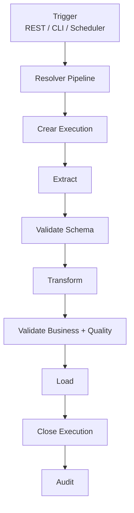
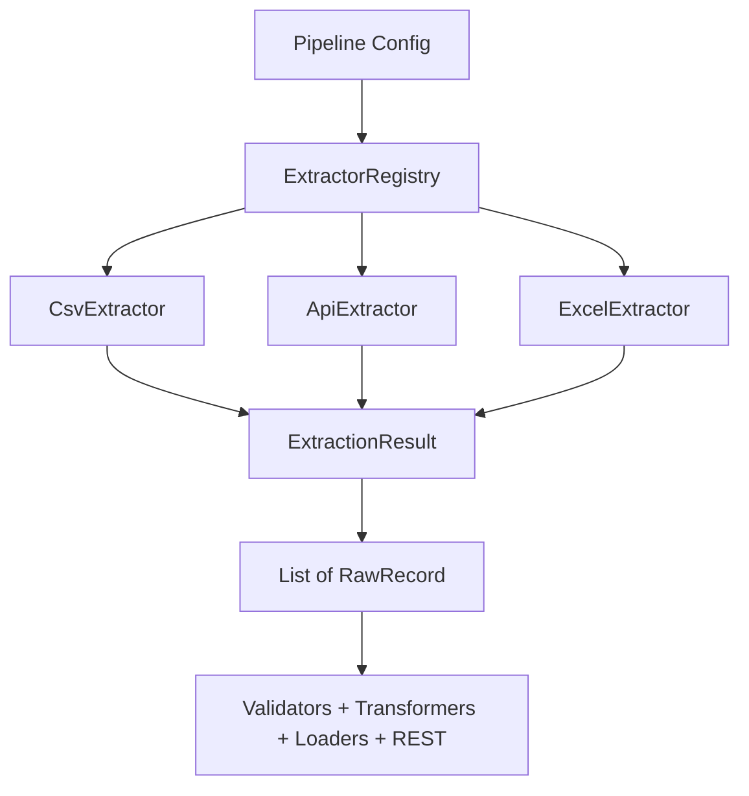
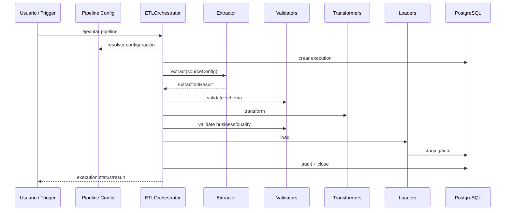
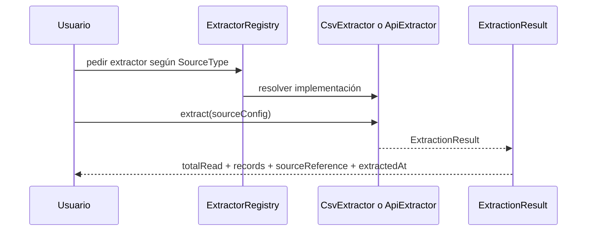
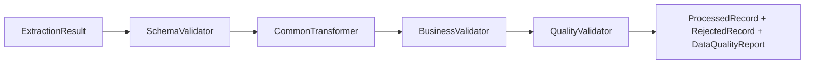
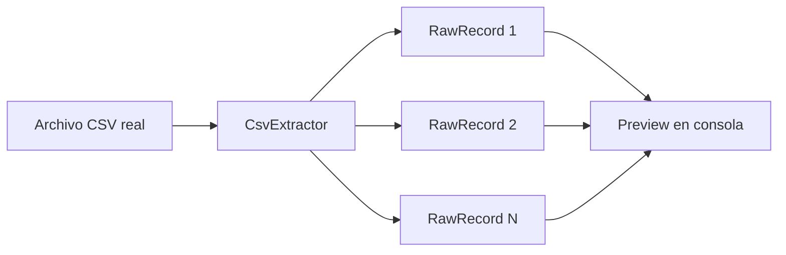

# Runbook: Entender OrionETL

Este documento explica OrionETL de forma simple:

- qué problema resuelve
- cuál es el flujo completo esperado del sistema
- qué partes ya existen hoy
- qué le tienes que pasar al sistema
- qué te va a regresar
- cómo usar lo que ya está implementado

Fecha de referencia: `2026-03-24`

---

## 1) Qué es OrionETL

OrionETL es un motor ETL.

ETL significa:

- `Extract`: leer datos desde una fuente
- `Transform`: limpiarlos, normalizarlos, convertirlos
- `Load`: guardarlos en un destino final

La idea del proyecto es que un pipeline tome datos de entrada, los valide, los transforme, los cargue a base de datos y deje trazabilidad completa de todo lo ocurrido.

---

## 2) Qué espera hacer el proyecto completo

Cuando OrionETL esté completo, el flujo esperado es este:



En palabras:

1. Alguien dispara un pipeline.
2. El sistema busca la configuración de ese pipeline.
3. Crea una ejecución.
4. Extrae datos desde CSV, API o Excel.
5. Valida estructura.
6. Transforma los registros.
7. Valida reglas de negocio y calidad.
8. Carga a staging/final.
9. Cierra la ejecución.
10. Registra auditoría.

---

## 3) Qué partes ya existen hoy

El proyecto todavía no está completo.

A día de hoy, lo que sí existe es esto:



Estado real por bloques:

- Fase 1: base del proyecto, listas las piezas principales
- Fase 2: core de dominio y orquestación, implementado
- Fase 3: persistencia, implementada
- Fase 4: extractores CSV y API, implementados
- Fase 5: transformadores y validadores base, implementados
- Fase 6: loaders reales a staging/final, implementada
- Fase 7: primer pipeline de negocio end-to-end (Sales), implementado
- Fase 8: REST y monitoreo base, implementados
- Fase 9: pipelines `inventory-sync` y `customer-sync`, implementados
- Fase 10 ya cerró el hardening V1: retries automáticos, notifications por log, Docker y roadmap V2
- para después de V1 siguen pendientes scheduler y capacidades operativas adicionales de V2

Traducción práctica:

- sí puedes extraer datos desde CSV, API y Excel
- sí puedes validar estructura y reglas de negocio en memoria
- sí puedes transformar registros con reglas comunes
- sí puedes cargar a staging y promover a final
- sí puedes hacer rollback por `etl_execution_id`
- sí puedes probar CSV, API y Excel
- sí puedes ver salida en consola para CSV
- sí puedes ejecutar los pipelines `sales-daily`, `inventory-sync` y `customer-sync` de punta a punta
- sí puedes disparar y monitorear ejecuciones por REST
- sí puedes consultar health, métricas y rechazados por REST
- todavía faltan más pipelines de negocio

---

## 4) Flujo lógico del sistema

### 4.1 Flujo esperado de punta a punta



### 4.2 Flujo que realmente puedes usar hoy



Y en el estado actual del repo, ya existe también este tramo en memoria:



---

## 5) Qué le tienes que pasar al sistema

Hoy, la entrada principal para extracción es `SourceConfig`.

Conceptualmente contiene esto:

```text
SourceConfig
├── type
├── location
├── encoding
├── delimiter
├── hasHeader
└── connectionProperties
```

### 5.1 Para CSV

Lo mínimo que tienes que pasar:

- `type = CSV`
- `location = ruta al archivo`

Opcionalmente:

- `encoding`
- `delimiter`
- `hasHeader`
- `connectionProperties.quoteChar`
- `connectionProperties.nullValues`
- `connectionProperties.headerMapping.*`

Ejemplo conceptual:

```text
type = CSV
location = /datasets/archive/fact_table.csv
encoding = UTF-8
delimiter = ,
hasHeader = true
connectionProperties:
  nullValues = ,NULL,N/A,-
  headerMapping.payment_key = payment_id
```

### 5.2 Para API

Lo mínimo que tienes que pasar:

- `type = API`
- `location = URL completa del endpoint`
- `connectionProperties.responseArrayPath`

Opcionalmente:

- `method`
- `paginationType`
- `cursorField`
- `pageParam`
- `pageSize`
- `timeoutMs`
- `maxRetries`
- `authType`
- credenciales según el tipo de auth

Ejemplo conceptual:

```text
type = API
location = https://mi-api/clientes
connectionProperties:
  method = GET
  responseArrayPath = customers
  paginationType = CURSOR
  cursorField = meta.next_cursor
  pageSize = 200
  timeoutMs = 30000
  authType = BEARER
  authTokenEnv = CRM_API_TOKEN
```

---

## 6) Qué te regresa el sistema hoy

Hoy, la salida de la fase de extracción es `ExtractionResult`.

Contiene:

- `records`
- `totalRead`
- `sourceReference`
- `extractedAt`
- `successful`
- `errorDetail`

El punto importante es `records`, porque ahí viene la lista de `RawRecord`.

Desde Fase 5, además ya existen estas salidas intermedias:

- `ValidationResult`
- `TransformationResult`
- `ProcessedRecord`
- `RejectedRecord`
- `DataQualityReport`

### 6.1 Qué es un `RawRecord`

Un `RawRecord` representa un registro sin transformar todavía.

Contiene:

- `rowNumber`
- `data`
- `sourceReference`
- `extractedAt`

Ejemplo conceptual:

```json
{
  "rowNumber": 2,
  "data": {
    "payment_id": "P026",
    "coustomer_key": "C004510",
    "quantity": "1",
    "unit_price": "35",
    "total_price": "35"
  },
  "sourceReference": "/datasets/archive/fact_table.csv"
}
```

---

## 7) Qué te va a regresar el sistema cuando esté completo

Cuando el flujo ETL esté completo, el usuario normalmente no trabajará directo con `ExtractionResult`, sino con algo más alto nivel:

- `executionId`
- estado de la ejecución
- contadores de registros
- errores
- auditoría
- métricas

Ejemplo esperado a futuro:

```json
{
  "executionId": "uuid",
  "pipelineId": "sales-daily",
  "status": "RUNNING"
}
```

Y luego:

```json
{
  "executionId": "uuid",
  "status": "SUCCESS",
  "totalRead": 1000000,
  "totalRejected": 120,
  "totalLoaded": 998880
}
```

Eso todavía es el objetivo final del proyecto, no el uso principal actual.

---

## 8) Entonces, hoy, cómo se usa realmente

Hoy tienes tres formas prácticas de trabajar con OrionETL:

### A. Correr tests

Sirve para validar que los extractores funcionan.

### B. Ejecutar preview de CSV

Sirve para ver filas reales extraídas en consola.

### C. Leer la salida de `ExtractionResult` a través de tests o código

Sirve para desarrollo y depuración del extractor.

---

## 9) Uso real de CSV hoy

### Lo que le pasas

- ruta del archivo
- delimiter
- encoding
- si tiene header
- null values
- header mapping

### Lo que hace

1. abre el archivo
2. lee filas
3. interpreta headers
4. aplica header mapping
5. convierte ciertos tokens a `null`
6. construye `RawRecord`
7. regresa `ExtractionResult`

### Lo que te regresa

- cuántas filas leyó
- lista de filas
- referencia del archivo

---

## 10) Uso real de API hoy

### Lo que le pasas

- URL del endpoint
- método HTTP
- `responseArrayPath`
- auth si aplica
- paginación si aplica
- timeout
- retries

### Lo que hace

1. construye el cliente HTTP
2. aplica auth
3. llama el endpoint
4. parsea JSON
5. busca el array en `responseArrayPath`
6. pagina si hace falta
7. convierte cada elemento en `RawRecord`
8. regresa `ExtractionResult`

### Lo que te regresa

- total de registros extraídos
- lista de registros en bruto
- URL fuente
- timestamp

---

## 11) Cómo verlo con tus ojos

La manera más fácil de entenderlo hoy es esta:



Si corres el preview CSV, vas a ver líneas como estas:

```text
csv_preview_total_read=1000000
row=2 data={"payment_id":"P026","coustomer_key":"C004510",...}
row=3 data={"payment_id":"P022","coustomer_key":"C008967",...}
```

Eso significa:

- el extractor sí leyó el archivo
- sí interpretó filas
- sí armó objetos `RawRecord`
- sí aplicó normalización

---

## 12) Qué comandos usar para entender el proyecto sin perderte

### 12.1 Ver una muestra real de CSV

```bash
docker run --rm \
  -v "$PWD":/workspace \
  -v /home/elyarestark/develop/datasets/archive:/datasets/archive \
  -w /workspace \
  maven:3.9.9-eclipse-temurin-21 \
  mvn -q spring-boot:run \
    -Dspring-boot.run.arguments="--spring.main.web-application-type=none,--orionetl.csv-preview.enabled=true,--orionetl.csv-preview.path=/datasets/archive/fact_table.csv,--orionetl.csv-preview.limit=10,--orionetl.csv-preview.null-values=,NULL,N/A,-,--orionetl.csv-preview.header-mapping.payment_key=payment_id"
```

### 12.2 Validar que los extractores pasan

```bash
docker run --rm \
  -v "$PWD":/workspace \
  -w /workspace \
  maven:3.9.9-eclipse-temurin-21 \
  mvn -q test-compile -Dtest=none -DfailIfNoTests=false -Dit.test=ApiExtractorIT,CsvExtractorIT failsafe:integration-test failsafe:verify
```

### 12.3 Leer la referencia de comandos

Archivo:

- `docs/cmd.md`

### 12.4 Leer cómo usar la Fase 4

Archivo:

- `docs/runbooks/using-phase4-extractors.md`

---

## 13) Resumen corto

Si lo quieres entender en una sola idea, es esta:

```text
Entrada -> Extractor -> RawRecords -> (futuro) validar -> transformar -> cargar -> auditar
```

Hoy el proyecto ya cubre muy bien:

- selección de extractor
- extracción CSV
- extracción API
- pruebas
- preview de CSV

Hoy el proyecto todavía no cubre completamente en operación diaria:

- transformación real de negocio
- validación end-to-end
- carga final completa
- interfaz REST completa para operar pipelines de punta a punta

---

## 14) Si te pierdes, piensa en estas dos preguntas

### ¿Qué le paso?

Le pasas configuración de la fuente:

- si es CSV: ruta y opciones de lectura
- si es API: URL y opciones HTTP

### ¿Qué me devuelve?

Te devuelve registros en bruto (`RawRecord`) agrupados dentro de `ExtractionResult`.

Eso es lo que hoy realmente ya funciona.
